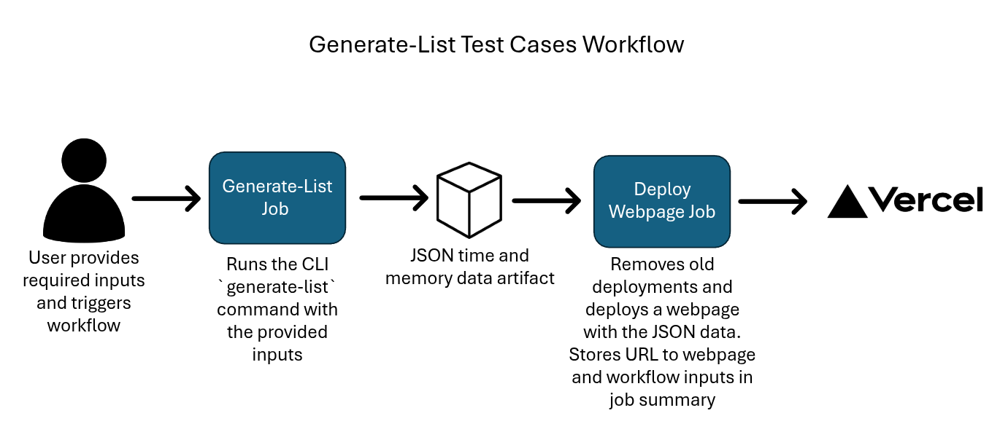
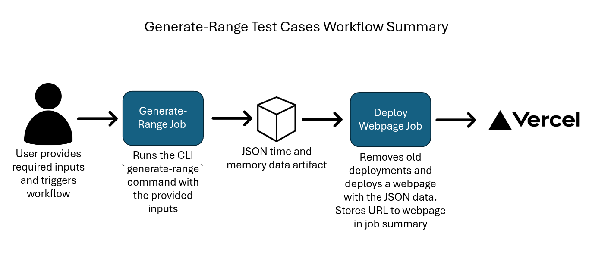
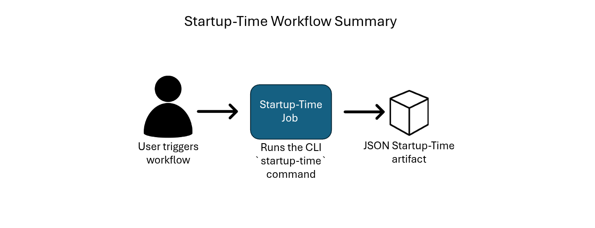
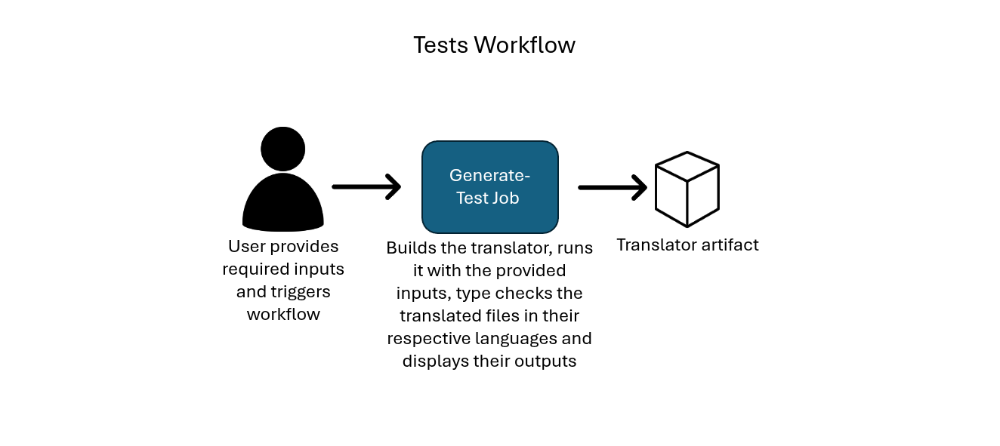

# CS 4ZP6A CAPSTONE

## Content
- [Project Goal](#ssProjectGoal) 
- [Group Members](#ssGroupMembers) 
- [Demo](#ssDemo) 
- [Technology Stack](#ssTechnologyStack)
- [Versions](#ssVersions)
- [Language Considerations](#ssLanguageConsideration)
- [Available Test Cases](#ssAvailableCases)
- [How To Add Test Cases](#ssAddCases)
    - [Writing Dynamic Test Cases in MHPG](#sssExtendMHPG)
    - [Extending CI](#sssExtendCI)
    - [Extending CLI](#sssExtendCI)
- [CI Workflow - Run System](#ssCIWorkflows)
    - [Build Workflow](#sssBuildWorkflow)
    - [Generate-List Test Cases Workflow](#sssListWorkflow)
    - [Generate-Range Test Cases Workflow](#sssRangeWorkflow)
    - [Startup-Time Workflow](#sssStartupWorkflow)
    - [Tests Workflow](#sssTestWorkflow)
    - [Additional Notes](#sssAddNotes)
- [CLI](#ssCLI)
    - [Local Installation Instructions](#sssInstallation)
    - [generate-list Command](#sssListCommand)
    - [generate-range Command](#sssRangeCommand)
    - [startup-time Command](#sssStartupCommand)
    - [print Command](#sssPrintCommand)
- [Graph Generation](#ssGraph)
- [Website](#ssWebsite)
- [Sources](#ssSources)

## Group Members <a id='ssGroupMembers'></a>
- Proyetei Akanda
- Esha Pisharody
- Zainab Abdulsada
- Grace Croome
- Marie Hollington
- Emma Willson


## Project Goal <a id='ssPojectGoal'></a>
The goal of this capstone project is to design and build an automated code generator that creates a series of tests of increasing size that will test the efficiency of modern
interactive proof assistants including Lean, Idris, Agda, and Rocq. Testing will first be performed on these assistants as ‘language’, then we will move forth with proof testing.
The project will also include a command line interface enabling users to view the time and memory complexity and provide a link redirecting them to local webpages presenting visualizations of the measured data.

## Demo <a id='ssDemo'></a>
This is an example output for one of the test cases, please run GitHub Actions to run your own tests!
https://capstone-proyetei-proyeteis-projects.vercel.app/

## Technology Stack <a id='ssTechnologyStack'></a>
- Haskell for building the translators, grammars, and the automated code generator creating test cases for each of the 4 proof assistants (Idris, Agda, Lean, Rocq)
- Includes a CI/CD pipeline in GitHub Actions to run the tests using Go + Docker and generating JSON file with the benchmarking results
- Flask + Python for the backend
- HTML/Tailwind CSS/JavaScript for frontend
- Vercel for deployment

## Versions <a id='ssVersions'></a>
- Python (3.12.3)
- Lean (4.17.0)
- Idris2 (0.7.0)
- Rocq (8.20.1)
- Agda (2.7.0.1)
- Nix Channel (24.11 and Unstable)
- Docker (26.1.3)
- GHC (9.4.7)
- Cabal (3.8.1.0)
- Go (1.23.6)

## Language Considerations <a id='ssLanguageConsideration'></a>
- Lean has maximum recursion depth set to 2000 and the maximum heartbeats disabled
- Lean has a limit of 256 fields in a record
- Lean has a limit of 127 parameters in a datatype, giving a 'type mismatch' error with any more

## Available Test Cases <a id='ssAvailableCases'></a>
<table>
    <tr>
        <th>Test Case</th>
        <th>Agda Example For Size N = 3</th>
    </tr>
    <tr>
        <td>LetExample (ID = 1)<br>A series of N nested let statements. <br>(Upper Bound Limit: 5000) </td>
        <td>
            <pre><code>n : Nat
n = let
    x1 = 1
 in
    let
    x2 = x1
 in
    let
    x3 = x2
 in
    x3</code></pre>
        </td>
    </tr>
    <tr>
        <td>LetAddExample (ID = 2)<br>A series of N nested let statements that define and use sequential variables based on previous definitions <br>(Upper Bound Limit: 1000)</td>
        <td>
            <pre><code>n : Nat
n = let
    x1 = 1
 in
    let
    x2 = x1  +  x1
 in
    let
    x3 = x2  +  x2
 in
    x3</code></pre>
        </td>
    </tr>
    <tr>
        <td>NestedFunction (ID = 3)<br>A series of N nested functions <br>(Upper Bound Limit: 250)</td>
        <td>
            <pre><code>n : Nat
n = let
    f1 : Nat -> Nat
    f1 x1 = x1 + 1
    f2 : Nat -> Nat -> Nat
    f2 x1 x2 = 1 + x1 + x2
    f3 : Nat -> Nat -> Nat -> Nat
    f3 x1 x2 x3 = 1 + x1 + x2 + x3
    in f3 2 3 4 + f2 2 3 + f1 2</code></pre>
        </td>
    </tr>
    <tr>
        <td>DataSimpleDeclarations (ID = 4)<br>A specified number of simple datatype declarations <br>(Upper Bound Limit: 1000)</td>
        <td>
            <pre><code>data x3 : Set where
 y : Bool
data x2 : Set where
 y : Bool
data x1 : Set where
 y : Bool</code></pre>
        </td>
    </tr>
    <tr>
        <td>LongIdentifier (ID = 5)<br>Variable declaration with an identifier of a specified length <br>(Upper Bound Limit: 30000000)</td>
        <td>
            <pre><code>xxx : Nat
xxx = 0</code></pre>
        </td>
    </tr>
    <tr>
        <td>Fields_DependentRecordModule (ID = 6)<br>A record declaration with N dependent fields <br>(Upper Bound Limit: 250)</td>
        <td>
            <pre><code>record X : Set where
    constructor Const
    field
        f1 : Nat
        f2 : Vec Nat f1
        f3 : Vec Nat (suc f1)

example : X
example = Const 1 (1 ∷ []) (1 ∷ 1 ∷ [])</code></pre>
        </td>
    </tr>
    <tr>
        <td>ChainDef_DependentRecordModule (ID = 7)<br>A very long chain (N) of dependent record definitions <br>(Upper Bound Limit: 10000)</td>
        <td>
            <pre><code>record Record1 : Set where
    constructor Const1
    field
        f1 : Nat
record Record2 : Set where
    constructor Const2
    field
        f2 : Record1
record Record3 : Set where
    constructor Const3
    field
        f3 : Record2

example : Record3
example =  Const3 (Const2 (Const1 10) )</code></pre>
        </td>
    </tr>
    <tr>
        <td>Parameters_DependentRecordModule (ID = 8)<br>A record with N parameters <br> (Upper Bound Limit: 3000)</td>
        <td>
            <pre><code>record X (f1 : Nat) (f2 : Nat) (f3 : Nat) : Set where
    constructor Const
    field
        sums : Nat

example : X 1 2 3
example = Const (1 + 2 + 3)</code></pre>
        </td>
    </tr>
    <tr>
        <td>NewlineFile (ID = 9)<br>A file with N newlines <br> (Upper Bound Limit: 20000000)</td>
        <td>
            <pre><code>

</code></pre>
        </td>
    </tr>
    <tr>
        <td>Fields_NonDependentRecordModule (ID = 10) <br> A record declaration with N independent fields <br> (Upper Bound Limit: 2000)</td>
        <td>
            <pre><code>record X : Set where
    constructor Const
    field
        f1 : Nat
        f2 : Nat
        f3 : Nat

example : X
example = Const 1 1 1</code></pre>
        </td>
    </tr>
    <tr>
        <td>ChainDefFields_NonDependentRecordModule (ID = 11) A very long chain (N) of independent record definitions<br> (Upper Bound Limit: 10000)</td>
        <td>
            <pre><code>record Record1 : Set where
    constructor Const1
    field
        f1 : Nat
record Record2 : Set where
    constructor Const2
    field
        f2 : Nat
record Record3 : Set where
    constructor Const3
    field
        f3 : Nat

example : Record3
example = Const 1</code></pre>
        </td>
    </tr>
    <tr>
        <td>Constructors_Datatypes (ID = 12)<br>defines a datatype with N simple constructors <br> (Upper Bound Limit: 20000)</td>
        <td>
            <pre><code>data d : Set where
 c1 : d 
 c2 : d 
 c3 : d</code></pre>
        </td>
    </tr>
    <tr>
        <td>Parameters_Datatypes (ID = 13)<br>defines a datatype with a single constructor accepting N parameters<br>(Upper Bound Limit: 5000)</td>
        <td>
            <pre><code>data d (p1: Type)  (p2: Type)  (p3: Type) : Set where
 c : d p1 p2 p3</code></pre>
        </td>
    </tr>
    <tr>
        <td>FirstLast_VariableModule (ID = 14)<br>defines N variables, and uses both the first and last one in a declaration, N>=2<br>(Upper Bound Limit: 25000)</td>
        <td>
            <pre><code>x1 : Nat
x1 = 1
x2 : Nat
x2 = 2
x3 : Nat
x3 = 3
result : Nat
result = x1 + x3</code></pre>
        </td>
    </tr>
    <tr>
        <td>DeepDependency_VariableModule (ID = 15)<br>Defines a series of dependent variables, with 10 variables at each level of dependency, and then utilizes the innermost variables in a subsequent expression<br>(Upper Bound Limit: 3500)</td>
        <td> For N = 1
            <pre><code>x1L1 : Nat
x1L1 = 1
x1L2 : Nat
x1L2 = 2
x1L3 : Nat
x1L3 = 3
x1L4 : Nat
x1L4 = 4
x1L5 : Nat
x1L5 = 5
x1L6 : Nat
x1L6 = 6
x1L7 : Nat
x1L7 = 7
x1L8 : Nat
x1L8 = 8
x1L9 : Nat
x1L9 = 9
x1L10 : Nat
x1L10 = 10
result : Nat
result = 100 + x1L1 + x1L2 + x1L3 + x1L4 + x1L5 + x1L6 + x1L7 + x1L8 + x1L9 + x1L10</code></pre>
        </td>
    </tr>
    <tr>
        <td>DataImplicitIndices (ID = 16)<br>A simple datatype declaration with a specified number of indices, defined implicitly<br>(Upper Bound Limit: 5000)</td>
        <td>
            <pre><code>data D : Nat -> Nat -> Nat -> Set where
 C1 : {x3 x2 x1 : Nat} -> D x3 x2 x1</code></pre>
        </td>
    </tr>
    <tr>
        <td>SingleLongLine (ID = 17)<br>A file consisting of a single long line with N characters<br>(Upper Bound Limit: 10000000)</td>
        <td>
            <pre><code>xxx</code></pre>
        </td>
    </tr>
    <tr>
        <td>ConstructorsParameters_Datatypes (ID = 18)<br>A single datatype where N represents the number of 'Type' parameters, all needed for N constructors<br>(Upper Bound Limit: 700)</td>
        <td>
            <pre><code>data D (P1: Type)  (P2: Type)  (P3: Type) : Set where
 C1 : D P1 P2 P3 
 C2 : D P1 P2 P3 
 C3 : D P1 P2 P3</code></pre>
        </td>
    </tr>
    <tr>
        <td>IndicesConstructors_Datatypes (ID = 19)<br>A single datatype where N represents the number of indices, with N constructors that each use a different number of indices<br>(Upper Bound Limit: 450)</td>
        <td>
            <pre><code>data D : Nat -> Nat -> Nat -> Nat -> Nat -> Set where
 C1 : {X1 : Nat} -> D X1 0 0 0 0 
 C2 : {X2 X1 : Nat} -> D X1 X2 0 0 0 
 C3 : {X3 X2 X1 : Nat} -> D X1 X2 X3 0 0 
 C4 : {X4 X3 X2 X1 : Nat} -> D X1 X2 X3 X4 0 
 C5 : {X5 X4 X3 X2 X1 : Nat} -> D X1 X2 X3 X4 X5 </code></pre>
        </td>
    </tr>
    <tr>
        <td>IndicesParameters_Datatypes (ID = 20)<br>A single datatype where N represents the number of 'Type' parameters as well as the number of indices<br>(Upper Bound Limit: 2000)</td>
        <td>
            <pre><code>data D (p1 : Set)  (p2 : Set)  (p3 : Set)  : Nat -> Nat -> Nat -> Set where
 C : {X3 X2 X1 : Nat} -> D p1 p2 p3 X1 X2 X3</code></pre>
        </td>
    </tr>
    <tr>
        <td>Pattern_Matching_Datatypes (ID = 21)<br>A function pattern matching on N constructors of a datatype<br>(Upper Bound Limit: 5000)</td>
        <td>
            <pre><code>data D : Set where
 C1 : D 
 C2 : D 
 C3 : D
N : Nat
N = let
    F: D -> Nat
        F C1 = 1 
        F C2 = 2 
        F C3 = 3 in
    F C3 + F C2 + F C1</code></pre>
        </td>
    </tr>

</table>

## How To Add Test Cases <a id='ssAddCases'></a>


### Writing Dynamic Test Cases in MHPG

The MHPG generalizes the structure of a program written in each of our 4 PALs. Most test cases are modules, which (may) contain imports and definitions. Definitions can be variable definitions, function definitions, data type definitions, record type definitions, record definitions, and sub-module definitions. They mostly consist of a name, a type, and an expression. Types include type constructors, dependent type constructors, parameterized type constructors, function types, type variables, and indexed types. We have also included the type constructor 'Suc' for the Nat type because Nat is implemented differently across the 4 PALs. If you would like to use a type that is implemented differently across the PALs, you will need to extend the Type type of the MHPG. See [Extending MHPG](#ssExtendingMHPG) for more. Expressions include Ints, Bools, Strings, unary operators, binary operators, let .. in expressions, if .. then .. else expressions, .. where expressions, function calls, Vectors, and Lists. If you would like to use an expression that is not currently supported by the Expression type, such as a lambda expression, you will need to extend the MHPG to include this.

To write your test case in the MHPG, you must compose it according to the structure of the MHPG. Let's work through an example test case written in Haskell:
```haskell
module LetExample where
import Numeric.Natural

n :: Natural
n = let x1 = 1 in
    let x2 = x1 in
        let x3 = x2 in
            x3
```
First, we need to write this test as an instance of the Module type. 
```haskell
data Module = Module { mod :: Name, imports :: [Import], defs :: [Definition] } 
        | File { fil :: Name, con :: String }
```
This test is a module named LetExample with one import and one variable definition.
```haskell
test :: Module
test = Module "LetExample" [ImportLib "Nat"] [
    DefVar "n" ...
    ]
```
According to the type of DefVar, our variable definition needs to include the variable name, maybe its type, and an expression that represents its value.
```haskell
DefVar Name (Maybe Type) Expr
```
In this test, the type of n is given as a natural number and it is expressed as three nested let statements. To see how to fit these let statements into each other, we look to the type of the Let constructor of the Expr type.
```haskell
Let [Definition] Expr
```
From this definition, we can see that the next Let constructor goes after the local variable definition. 
```haskell
Let [
        DefVar "x1" Nothing $ Int 1
    ] $ Let [
        DefVar "x2" Nothing $ Var "x1"
    ] $ Let ...
```
Putting this all together gives us the test expressed in MHPG:
```haskell
test :: Module
test = Module "LetExample" [ImportLib "Nat"] [
    DefVar "n" (Just $ Con "Nat") $ Let [
        DefVar "x1" Nothing $ Int 1
    ] $ Let [
        DefVar "x2" Nothing $ Var "x1"
    ] $ Let [
        DefVar "x3" Nothing $ Var "x2"
    ] $ Var "x3"
    ]
```
We can now generalize this test so it can be resized by the test case generator. Test cases are recorded in a list named _tests in Tests.hs. The elements of _tests are of the type Int -> Module and are conventionally written as anonymous functions with the parameter n, which represents the "size" of the test case. 
```haskell
\n -> let
        iszero 0 = []
        iszero _ = [DefVar "n" (Just $ Con "Nat") $ lets 1]
        xs 0 = Int 1
        xs m = Var $ "x" ++ show m
        lets p = 
            if p==n then Let [DefVar ("x"++ show p) Nothing $ xs $ p-1] $ xs p 
            else Let [DefVar ("x"++ show p) Nothing $ xs $ p-1] $ lets $ p+1
    in Module "LetExample" [ImportLib "Nat"] $ iszero n
```
### Extending MHPG <a id='ssExtendingMHPG'></a>

If you would like to write a test case that uses language constructs that are not currently supported by the MHPG, you will need to extend it. This will most likely be done by adding a constructor to Definition, Expression, or Type. Make sure to include parameters for all the information required for that construct by each language. For example, if one language requires a type signature for a certain kind of definition, but its type signature is optional for the other languages, the constructor that you write should require the type of the definition. 

Note that changes to the MHPG will affect each Print_.hs file and may also affect the Tests.hs file. If you add/change a type in Grammar.hs, you will need to add/change the translation for that type in each language. If you change an existing type which is used in another test, you will need to update that test with the correct constructor arguments. 

### Extending CI Workflows <a id='sssExtendCI'></a>

To add a new test case, update the workflows in the following files:
- `./github/workflows/test.yml`
- `./github/workflows/generate.yml`
- `./github/workflows/generate-list.yml` 

In each file, include the test case in the user input section as shown below:

```
on:
  workflow_dispatch:
    inputs:
      testcase:
        type: choice
        required: true
        description: Select the test case you would like to generate
        options: 
          - 1 [LetExample]
          - 2 [LetAddExample]
          .
          .
          . 
          - <Test Case ID> [<File Name>] 
```

### Extending CLI <a id='sssExtendCLI'></a>

1.  **Update Test Case List:** 
- Open `cli/cmd/info.go`.
- Find `Case_list` variable.
- Add new test case to this list in the following format:
```
<Test Case ID (int)>: {
		<Test Case ID (int)>,
		"<Test Case Description (string)>",
		"<File Name (string)> ",
		<Upper Bound For Size (int)>,
	},
```

2. **Increment the maxID variable:**
- In the `cli/cmd/root.go` file, increase the `maxID` variable by 1.

**Note** The test case ID should be the integer following the last test case ID in the `Case_list` variable. 

## CI Workflows - Run System <a id='ssCIWorkflows'></a>

The CI implemented in github actions consists of 5 workflows (Build, Generate-List Test Cases, Generate-Range Test Cases, Startup-Times, Tests). 

### Build Workflow <a id='sssBuildWorkflow'></a>
Allows users to build the CLI and the translator as well as creating and pushing the docker image. 


**Required Inputs**: None

**Usage**: 
1. Navigate to the 'Actions' tab.
2. Select the 'Build Cases' tab.
3. Click the 'Run Workflow' button.
4. Fill in the required inputs.
5. Click 'Run Workflow'.

**Triggers**: On push + Manual

### Generate-List Test Cases Workflow <a id='sssListWorkflow'></a>
Allows users to generate and type check a selected test case at specific sizes in Agda, Idris, Lean, and Rocq, and provides a URL where users can access the webpage with the time and memory results. 



**Required Inputs**: Test Case, Datapoint List
- **Test Case:** Specifies which test case the data is generated for (select from provided list).
- **Datapoint List:** The list of sizes for the test case, can include up to 150 values (≥ 1) in comma-separated format (eg 1,2,3).

**Usage**: 
1. Navigate to the 'Actions' tab.
2. Select the 'Generate-Range Test Cases' tab.
3. Click the 'Run Workflow' button.
4. Fill in the required inputs.
5. Click 'Run Workflow'.

**Triggers**: Manual

### Generate-Range Test Cases Workflow <a id='sssRangeWorkflow'></a>
 Allows users to generate and type check a selected over a range of sizes with a linear, quadratic or log interval in Agda, Idris, Lean, and Rocq, and provides a URL where users can access the webpage with the time and memory results. 



**Required Inputs**:
- **Test Case:** Specifies which test case the data is generated for (select from provided list)
- **Lower Bound:** The lower bound for the generated sizes of the test case (must be an integer ≥ 1) 
- **Upper Bound:** The upper bound for the generated sizes of the test case (must be an integer ≥ lower bound)
- **Number of Datapoints:** The number of generated datapoints (must be an integer between 1 and 150)
- **Interval Type:** The interval between the generated datapoints (select from provided list of linear, quadratic, and log)

**Usage**: 
1. Navigate to the 'Actions' tab.
2. Select the 'Generate-Range Test Cases' tab.
3. Click the 'Run Workflow' button.
4. Fill in the required inputs.
5. Click 'Run Workflow'. 

**Triggers**: Manual

### Startup-Time Workflow <a id='sssStartupWorkflow'></a>
Allows the user to records the startup time for each test case in Agda, Idris, Lean, and Rocq, saving the data to a JSON file `startup.json`



**Required Inputs**: None

**Usage**: 
1. Navigate to the 'Actions' tab.
2. Select the 'Startup-Time' tab.
3. Click the 'Run Workflow' button.
4. Fill in the required inputs.
5. Click 'Run Workflow'.

**Triggers**: Manual

### Tests Workflow <a id='sssTestWorkflow'></a>
Allows users to test the translator for a selected testcase at a size between 1 and 20.



**Required Inputs**:
- **Test Case:** Specifies which test case is translated and type checked (select from provided list)
- **Size:** Specifies the size we want the translated test case to be (must be an integer value between 1 and 20)

**Usage**: 
1. Navigate to the 'Actions' tab.
2. Select the 'Tests' tab.
3. Click the 'Run Workflow' button.
4. Fill in the required inputs.
5. Click 'Run Workflow'. 

**Triggers**: Manual

### Additional Notes <a id='sssAddNotes'></a>
- **Memory Limit:** The Generate-List and Generate-Range workflows have a maximum memory limit of **10GB** for type checking commands. 
- **Artifact Retention:** Artifacts from each workflow have a retention period of **2 days**
- **Docker Container Usage:** The Generate-Range, Generate-List, and Startup-Time workflows uses the Docker container associated with the branch the workflow is running on. For example, if the Generate-List workflow is running on a branch called `feature_branch`, it will use the Docker image `mphgeez/mhpg:feature_branch`. The main branch uses the `latest` tag.
- **Workflow Failiure:** If a Generate-List or Generate-Range Worflow fails, Check the `generate-list/generate-range` job logs to ensure the provided inputs were valid (under `Run Tests` step).
- **Vercel Deployment Management:** Before the Generate-List or Generate-Range Worflows deploy to vercel, a Python script is run to remove deployments older than **24 hours** and to ensure there are less than **15 active deployments**. If there are 15 ore more deployments, the oldest deployments  are removed until there are only **14** (the free version of Vercel has a limit of 100 preview deployments a day, max 100 tests a day).
- **Workflow Inputs:** Any required inputs are stored the inputs in the job summary at the beginning of the workflow (`workflow-inputs` job). 

## CLI <a id='ssCLI'></a>
CLI tool for generating and analyzing test cases of varying sizes across Lean, Idris, Agda, and Rocq.

### Local Installation Instructions <a id='sssInstallation'></a>
1. Install Docker https://docs.docker.com/engine/install/
2. Pull Docker image `docker pull mhpgeez/mhpg`
3. For CLI usage information run the Docker container using the command: `docker run -it --rm mhpgeez/mhpg:latest help` (**note** In the help section, ignore the 'mhpgeez' prefix since it is the entrypoint of the Docker container)
4. To run a test, use the command: `docker run -it --name benchpal -p "5001:5001" mhpgeez/mhpg:latest [COMMAND] [FLAGS]` 

### generate-list Command <a id='sssListCommand'></a>

**Description:** Generates and type checks a selected test case at a provided list of sizes in Agda, Idris, Lean, and Rocq, and provides a URL where users can access the webpage with the time and memory results.

```
Usage:
  mhpgeez generate-list [flags]

Flags:
  -d, --datapoints ints   List of up to 150 sizes (≥ 1) in comma-separated format (eg 1,2,3)
  -h, --help              help for generate-list
  -m, --max-memory int    Memory limit for the type checking commands in GB (between 1 to 15) (default 3)
  -t, --testcase int      Specifies which test case the data is generated for (default 1)
  -v, --verbose           Enable detailed output for debugging and progress tracking
  -w, --webpage           Generates webpage with graph visualizations (default true)

```
**Behaviour:**
1. **Validate Input:** Check if the input is valid. Exit the program with an error message if invalid.
2. **Sort List:** Arrange the list of sizes in ascending order.
3. **Initialize Exit Status:** Set the exit status for all languages to "OK."
4. **Translate Test Case:** Translate the selected test case for the first size in the sorted list (no timeout set for translation)
5. **Type Check Execution:** Execute the type check command on the translated files for all languages with an "OK" exit status. Record the time and memory usage using GNU time command (type check commands have 120s timeout).
6. **Error Handling:** If a type check times out, record the exit status as a time error. For any other error, record it as a memory error (program assumes that translation is correct, with no parsing, import, or syntax errors).
7. **Memory Limit Check:** For Idris and Rocq, which do not allow a memory limit to be set, check that the recorded memory is less than the memory limit provided by the user (Default 3GB). If it is greater than or equal to the memory limit, set the exit status of the language to indicate a memory error.
8. **Normalize Data** Subtract startup times from the recorded times to normalize the data. If the startup time is larger than the recorded time, record the time as an artificial zero. 
9. **Repeat Process:** Repeat steps 4-8 for all sizes in the sorted list unless all languages have a non "OK" exit status.
10. **Store Data:** Save the time and memory usage data in a JSON file (data.json).
11. **Generate Graphs:** Run a Python script to generate graphs from the JSON file and deploy a webpage at `http://127.0.0.1:5001/`.
12. **Terminate Command:** Use `CTRL + C` to terminate the command and close the webpage.

**Example Run:** `docker run -it --name benchpal -p "5001:5001" mhpgeez/mhpg:latest generate-list -t 1 -d 1,2,3 -v`

**Get startup.json:** `docker cp benchpal:/code/data.json ./`

### generate-range Command <a id='sssRangeCommand'></a>
```
Usage:
  mhpgeez generate-range [flags]

Flags:
  -d, --datapoints int    The number of generated datapoints (between 1 and 150) (default 5)
  -h, --help              help for generate-range
  -i, --interval string   The interval between datapoints (log, linear, quadratic) (default "linear")
  -l, --lower int         The lower bound for the generated sizes of the test case (>= 1) (default 1)
  -m, --max-memory int    Memory limit for the type checking commands in GB (between 1 to 15) (default 3)
  -t, --testcase int      Specifies which test case the data is generated for (default 1)
  -u, --upper int         The upper bound for the generated sizes of the test case (default 500)
  -v, --verbose           Enable detailed output for debugging and progress tracking
  -w, --webpage           Generates a webpage with graph visualizations (default true)
```

**Behaviour:**
1. **Validate Input:** Check if the input is valid. Exit the program with an error message if invalid.
2. **Initialize Exit Status:** Set the exit status for all languages to "OK."
3. Determine the first size based on the provided interval type. 
4. **Translate Test Case:** Translate the selected test case for the first size (no timeout set for translation)
5. **Type Check Execution:** Execute the type check command on the translated files for all languages with an "OK" exit status. Record the time and memory usage using GNU time command (type check commands have 120s timeout).
6. **Error Handling:** If a type check times out, record the exit status as a time error. For any other error, record it as a memory error (program assumes that translation is correct, with no parsing, import, or syntax errors).
7. **Memory Limit Check:** For Idris and Rocq, which do not allow a memory limit to be set, check that the recorded memory is less than the memory limit provided by the user (Default 3GB). If it is greater than or equal to the memory limit, set the exit status of the language to indicate a memory error.
8. **Normalize Data** Subtract startup times from the recorded times to normalize the data. If the startup time is larger than the recorded time, record the time as an artificial zero. 
9. **Log Interval Handling:** If the selected interval is 'log,' take the log of each time and memory value. If any time is equal to or less than 0, set the time to the log base 2 of 0.01. 
10. **Increment Size:** Increment the size based on the interval type.
11. **Repeat Process:** Repeat steps 4-10 for the next size unless all languages have a non "OK" exit status, the incremented size exceeds the upper bound, or the number of data points exceeds the user-defined limit.
12. **Store Data:** Save the time and memory usage data in a JSON file (data.json).
13. **Generate Graphs:** Run a Python script to generate graphs from the JSON file and deploy a webpage at `http://127.0.0.1:5001/`.
14. **Terminate Command:** Use `CTRL + C` to terminate the command and close the webpage.

**Example Run:** `docker run -it --name benchpal -p "5001:5001" mhpgeez/mhpg:latest generate-range -t 1 -l 1 -u 500 -d 5 -v`

**Get data.json:** `docker cp benchpal:/code/data.json ./`

### startup-time command <a id='sssStartupCommand'></a>
**Description:** Records the startup time for each test case in Agda, Idris, Lean, and Rocq, saving the data to a JSON file called startup.json.

```
Usage:
  mhpgeez startup-time [flags]

Flags:
  -h, --help      help for startup-time
  -v, --verbose   Enable detailed output for debugging and progress tracking
```

**Behaviour**: 
- Translates each test case of size 0 (files containing only import statements)
- Type check each file in its respective languages
- Record the real time, user time, and system time for the type check
- Repeat 10 times
- Fastest real, user, system times for each test case in each language is stored in the startup.json file


**Example Run:** `docker run -it mhpgeez/mhpg:latest startup-time -v`

**Get startup.json:** `docker cp benchpal:/code/startup.json ./`


### print Command <a id='sssPrintCommand'></a>
**Description:** Prints the available test cases (id, description) and their maximum upper bounds.
```
Usage:
  mhpgeez print [flags]

Flags:
  -h, --help   help for print

```
**Behaviour:** 
- Prints a table containing information about each test case. 

**Example Run:** `docker run -it --rm mhpgeez/mhpg:latest print`

## Graph generation <a id='ssGraph'></a>

#### Libraries and APIs used:

| Library           | Purpose                                                                 |
|-------------------|-------------------------------------------------------------------------|
| **Flask**         | Web server setup, routing (`@app.route`), and HTML templating (`render_template`). |
| **Matplotlib**    | Graph generation (time/memory complexity plots) with non-GUI backend (`'Agg'`). |
| **OS**            | File path handling (`os.path.join`, `os.path.dirname`).                |
| **Base64**        | Encoding plot images to base64 for HTML embedding.                      |
| **IO (BytesIO)**  | In-memory binary storage of plot images (avoiding disk writes).         |

## Website <a id='ssWebsite'></a>
- Displays benchmark results in the website.
- Shows the four types of performance graphs (real/user/system time + memory) as embedded images
- An error message appears if one exists with information on the size, language, and type of error
- Built with Python, Flask, HTML and Tailwind CSS, it works seamlessly on Vercel by converting graphs to base64 text.  

## Sources <a id='ssSources'></a>
- https://discourse.nixos.org/t/how-to-use-nix-only-in-docker-for-a-project/18043
- https://dev.to/aws-builders/running-jobs-in-a-container-via-github-actions-securely-p0c
- https://github.com/rishabkumar7/aws-devops-capstone-project/blob/main/.github/workflows/build-docker.yaml
- https://goobar.dev/manually-triggering-github-actions-workflows/
- https://forum.golangbridge.org/t/killing-child-process-on-timeout-in-go-code/995
- https://stackoverflow.com/a/67752977
- https://jarv.org/posts/command-with-timeout/
- https://qmacro.org/blog/posts/2021/03/26/mass-deletion-of-github-actions-workflow-runs/
