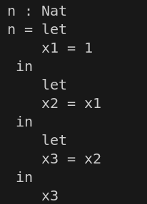
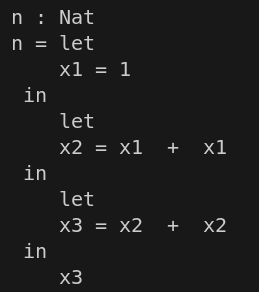
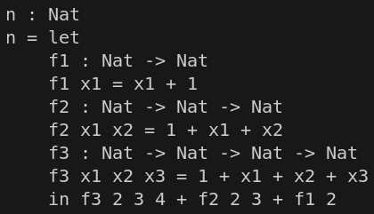
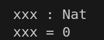
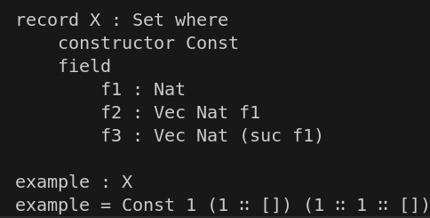
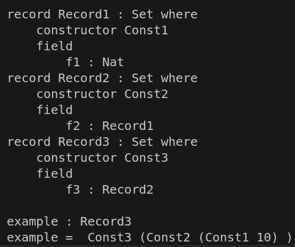

# CS 4ZP6A CAPSTONE

## Content
- [Project Goal](#ssProjectGoal) 
- [Group Members](#ssGroupMembers) 
- [Demo](#ssDemo) 
- [Technology Stack](#ssTechnologyStack)
- [Available Test Cases](#ssAvailableCases)
- [How To Add Test Cases](#ssAddCases)
- [CI](#ssCI)
- [CLI](#ssCLI)
- [Sources](#ssSources)

## Group Members 
- Proyetei Akanda
- Esha Pisharody
- Zainab Abdulsada
- Grace Croome
- Marie Hollington
- Emma Willson

## Project Goal 
The goal of this capstone project is to design and build an automated code generator that creates a series of tests of increasing size that will test the efficiency of modern
interactive proof assistants including Lean, Idris, Agda, and Coq. Testing will first be performed on these assistants as ‘language’, then we will move forth with proof testing.
The project will also include a command line interface enabling users to view the time and memory complexity and provide a link redirecting them to local webpages presenting visualizations of the measured data.

## Demo 
This is an example output for one of the test cases, please run GitHub Actions to run your own tests!
https://capstone-proyetei-proyeteis-projects.vercel.app/

## Technology Stack 
- Haskell for building the translators, grammars, and the automated code generator creating test cases for each of the 4 proof assistants (Idris, Agda, Lean, Rocq)
- Includes a CI/CD pipeline in GitHub Actions to run the tests using Go + Docker and generating JSON file with the benchmarking results
- Flask + Python for the backend
- HTML/CSS/JavaScript for frontend
- Vercel for deployment

## Available Test Cases 
<table style="width: 60%;">
    <tr>
        <th style="width: 30%;">Test Case</th>
        <th style="width: 70%;">&nbsp;&nbsp;&nbsp;&nbsp;&nbsp;Example (N = 3)&nbsp;&nbsp;&nbsp;&nbsp;</th>
    </tr>
    <tr>
        <td style="vertical-align: top;">LetExample (ID = 1) A series of N nested let statements. </td>
        <td></td>
    </tr>
    <tr>
        <td style="vertical-align: top;">LetAddExample (ID = 2) A series of N nested let statements that define and use sequential variables based on previous definitions</td>
        <td></td>
    </tr>
    <tr>
        <td style="vertical-align: top;">NestedFunction (ID = 3) A series of N nested functions</td>
        <td></td>
    </tr>
    <tr>
        <td style="vertical-align: top;">DataSimpleDeclarations (ID = 4) A specified number of simple datatype declarations</td>
        <td></td>
    </tr>
    <tr>
        <td style="vertical-align: top;">LongIdentifier (ID = 5) Variable declaration with an identifier of a specified length</td>
        <td></td>
    </tr>
    <tr>
        <td style="vertical-align: top;">Fields_DependentRecordModule (ID = 6) A record declaration with N dependent fields</td>
        <td></td>
    </tr>
    <tr>
        <td style="vertical-align: top;">ChainDef_DependentRecordModule (ID = 7) A very long chain (N) of dependent record definitions</td>
        <td></td>
    </tr>
</table>

## How To Add Test Cases 

## CI 

## CLI 

## Sources 
- https://www.youtube.com/watch?v=U7TY_qUD8yA
- https://github.com/marketplace/actions/build-and-push-docker-images
- https://discourse.nixos.org/t/how-to-use-nix-only-in-docker-for-a-project/18043
- https://stackoverflow.com/questions/48470049/build-a-json-string-with-bash-variables
- https://stackoverflow.com/questions/3795470/how-do-i-get-just-real-time-value-from-time-command
- https://community.unix.com/t/storing-output-of-time-command-to-a-variable/281158/2
- https://dev.to/aws-builders/running-jobs-in-a-container-via-github-actions-securely-p0c
- https://github.com/rishabkumar7/aws-devops-capstone-project/blob/main/.github/workflows/build-docker.yaml
- https://goobar.dev/manually-triggering-github-actions-workflows/

